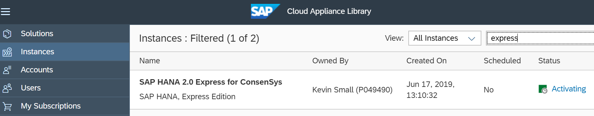
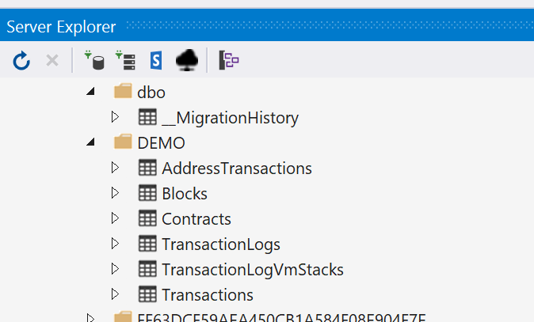
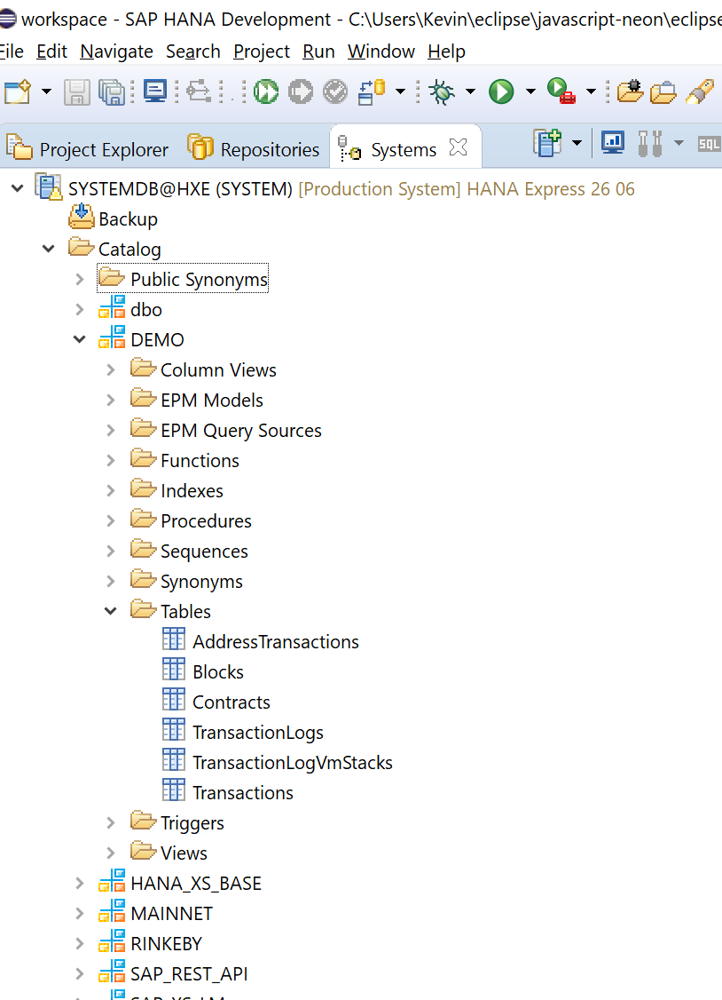
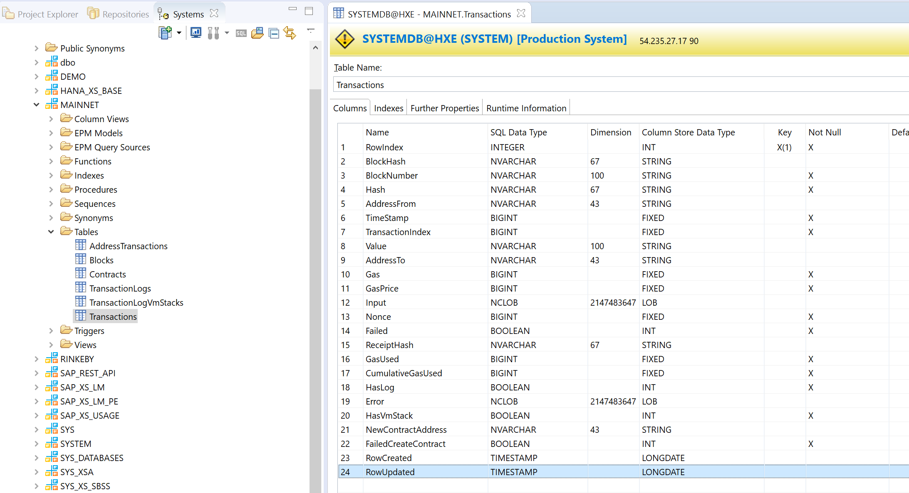
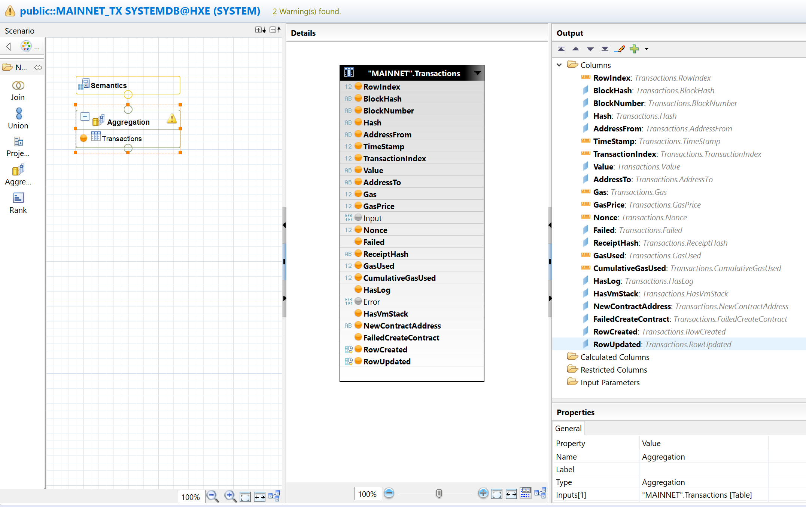
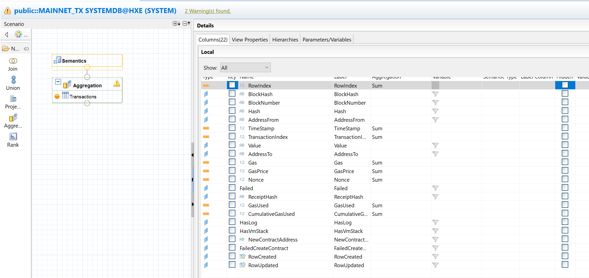
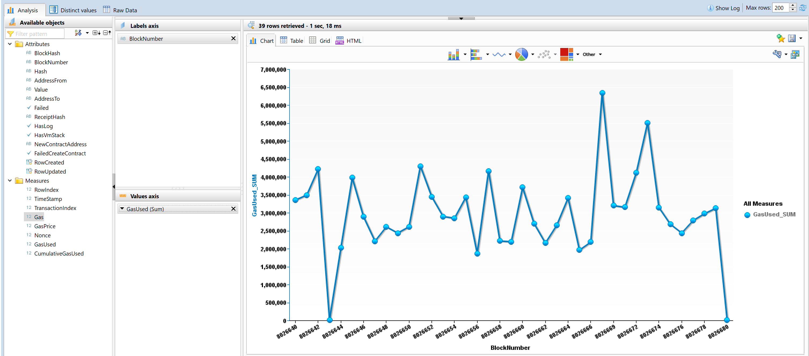

# How to Analyse Ethereum Blockchain Data using SAP HANA

## --- work in progess ---

In this article you will learn how to provide a real-time feed of Ethereum blockchain data into a HANA system at the table level. Think of SAP's SLT (SAP Landscape Transformation Replication Server) product but for blockchain data.

Why might you want to do this? Blockchains can execute transactions and business logic across a network without requiring a central authority to validate and complete that work. A popular public blockchain is Ethereum. You may be interested in analysing business-related transactions taking place on the Ethereum network.

TODO more overview explaining broad data flow is:

```
Ethereum -> Infura -> Nethereum -> Entity Framework -> SAP HANA Data Provider -> HANA System -> Analystics Tool of your choice.
```

## 1) Setup HANA System
TODO setup hana box from [SAP Cloud Appliance Library](https://cal.sap.com) (CAL) or you can use an existing box. From CAL:



The SAP HANA data adaptor supports HANA 2.x only, not HANA 1.x.

TODO create schema for MAINNET and dbo
```
create schema "dbo";
create schema "MAINNET";
```
TODO give rights to MAINNET schema to _SYS_REPO (grant...)
```
grant select on schema "MAINNET" to _sys_repo with grant option;
```
The loading process creates the tables it needs, but the schemas must exist.

## 2) Setup Visual Studio and HANA Client
Install [Visual Studio 2017](https://visualstudio.microsoft.com/vs/older-downloads/). At the time of writing, the SAP HANA Visual Studio plug-in only works with VS 2017. This plug-in is not critical, but it is convenient to use it to check the HANA connection and run HANA SQL scripts from Visual Studio.

Follow steps 3 to 13 from https://help.sap.com/viewer/1efad1691c1f496b8b580064a6536c2d/Cloud/en-US/7017cce72a054111b71cc713762e365c.html;

By default the DLLs are installed to:
```C:\Program Files\sap\hdbclient\ado.net\v4.5```

See also: https://help.sap.com/viewer/1efad1691c1f496b8b580064a6536c2d/Cloud/en-US/469de1336d6110148c9feec83dbeb4f0.html

If in future you need to uninstall, run `hdbuninst.exe`.

### Install .VSIX for 2017 (Optional)
This step is optional. It installs a VS plugin that lets you browse tables and run SQL on the HANA box from inside VS. It is like having limited functionality from the HANA Studio IDE available to you inside VS.

Find and run HanaExplorer.vsix

### TODO check VS can connect to your hana box

## 3) Clone Nethereum Repository
TODO clone the blockchain processing repo

## 4) Load Blockchain Data to HANA
TODO edit and run the hana console program from blockchain processing repo (refer to the README.md file there)
The necessary tables are created at runtime.

```
> Nethereum.BlockchainStore.EF.Hana.Console --HanaSchema MAINNET --FromBlock 8026640 --ToBlock 8026642 --BlockchainUrl "https://mainnet.infura.io/"
```

View of Schemas from Visual Studio Server Explorer


View of Schemas from HANA Studio (Eclipse)


Table definition in HANA


## 5) Analyse data in HANA
TODO create a calc view for simple consumption





A simple chart from within HANA Studio, showing gas consumption per block:

